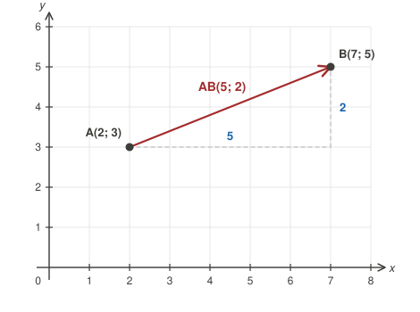
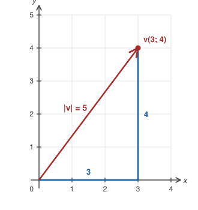
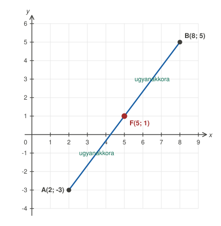
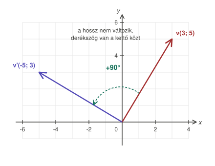
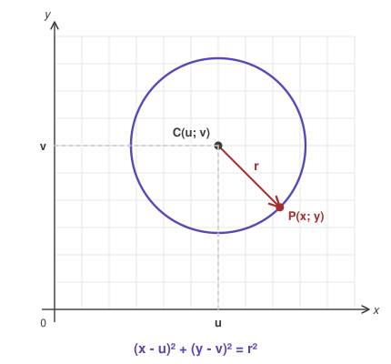
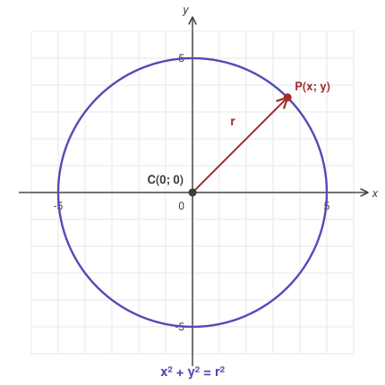
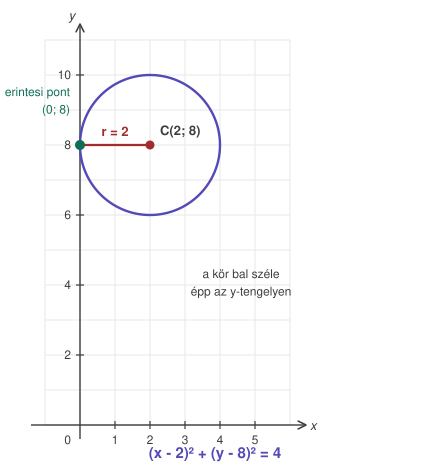
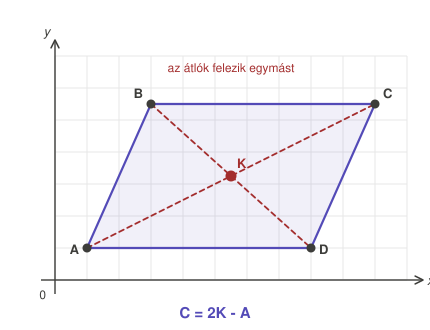

# Vektorok és a kör egyenlete — teljes felkészülés

> Vektor alapok → műveletek → hossz → felezőpont → forgatás → kör egyenlete → paralelogramma → feladatok megoldással.

---

## 1. Vektor alapfogalmak

Egy vektornak **iránya** és **hossza** van. Koordinátákkal: **v(x; y)**.

**Helyvektor:** az origóból egy adott pontba mutató vektor. Az A(3; 5) pont helyvektora a(3; 5) — a koordináták ugyanazok.

**Egységvektorok:**

| jel | koordináta | hossz |
|---|---|---|
| **i** | (1; 0) | 1 |
| **j** | (0; 1) | 1 |

Ezért **v = 6i − 8j** ugyanaz, mint **v(6; −8)**.

---

## 2. Az AB vektor koordinátái

**Végpont mínusz kezdőpont.**

Ha A(a₁; a₂) és B(b₁; b₂), akkor **AB = (b₁ − a₁; b₂ − a₂)**



```
A(2; 3), B(7; 5)

x: 7 − 2 = 5
y: 5 − 3 = 2

AB(5; 2)
```

> **Leggyakoribb hiba:** felcserélni a sorrendet. Az AB nem ugyanaz, mint a BA — a BA minden koordinátája az ellentettje.
>
> **Ellenőrzés:** ha B jobbra van A-tól, az x pozitív. Ha balra, negatív. Ugyanígy fel/le az y-ra.

---

## 3. Műveletek vektorokkal

| Művelet | Szabály | Példa |
|---|---|---|
| Összeadás | koordinátánként összeadunk | (2; 3) + (1; 4) = (3; 7) |
| Kivonás | koordinátánként kivonunk | (5; 6) − (2; 1) = (3; 5) |
| Számszoros | minden koordinátát szorzunk | 3 · (2; 4) = (6; 12) |

**Összetett feladatnál mindig két lépés.** Számold ki **2a − 3b**, ha a(3; −1) és b(−2; 4):

```
1. lépés — a számszorosok külön:
   2a = (2·3; 2·(−1)) = (6; −2)
   3b = (3·(−2); 3·4) = (−6; 12)

2. lépés — kivonás koordinátánként:
   x: 6 − (−6) = 6 + 6 = 12
   y: −2 − 12        = −14

   2a − 3b = (12; −14)
```

> Ne próbáld egy lépésben — a mínusz-mínusz hibák itt keletkeznek.

---

## 4. Vektor hossza (abszolút érték)

$$|v| = \sqrt{x^2 + y^2}$$

Ez a Pitagorasz-tétel: a vektor a derékszögű háromszög átfogója.



> **A négyzetre emelés eltünteti a mínuszt!** (−8)² = +64, nem −64.
> Ezért v(6; −8) és v(6; 8) hossza egyaránt 10.

**Érdemes fejből tudni** (ezek jönnek ki dolgozatban):

```
3 – 4  – 5        6 – 8  – 10
5 – 12 – 13       8 – 15 – 17
7 – 24 – 25       9 – 40 – 41
```

**Két pont távolsága** ugyanez a képlet:

$$d_{AB} = \sqrt{(b_1 - a_1)^2 + (b_2 - a_2)^2}$$

---

## 5. Felezőpont

$$F\left(\frac{a_1 + b_1}{2};\ \frac{a_2 + b_2}{2}\right)$$

**Csak összeadás és osztás — nincs benne négyzetre emelés!** (Ezt könnyű összekeverni a távolságképlettel.)



```
A(2; −3), B(8; 5)

x: (2 + 8)/2  = 10/2 = 5
y: (−3 + 5)/2 = 2/2  = 1

F(5; 1)
```

> **Józan ész próba:** a felezőpontnak a két pont **között** kell lennie. Ha A x-e 2 és B x-e 8, akkor F x-e 2 és 8 közt van. Ha 50 jön ki, biztosan hiba.

### Visszafelé: hiányzó végpont

```
Adott: F(2; −1), A(−3; 4)

x-re:  2 = (−3 + b₁)/2    | ·2
       4 = −3 + b₁        | +3
       b₁ = 7

y-ra: −1 = (4 + b₂)/2     | ·2
      −2 = 4 + b₂         | −4
      b₂ = −6

B(7; −6)
```

**Gyorsítás dolgozaton:** `B = 2F − A` → (2·2 − (−3); 2·(−1) − 4) = (7; −6)

---

## 6. Forgatás 90°-kal az origó körül ⚠️

Ez a leggyakoribb hibaforrás. **Két lépés, mindig ugyanaz:**

| Irány | Szabály | Menet |
|---|---|---|
| **+90°** (balra) | (x; y) → **(−y; x)** | cserélsz, majd az **első** tag ellentettje |
| **−90°** (jobbra) | (x; y) → **(y; −x)** | cserélsz, majd a **második** tag ellentettje |

**Mindkét irányban cserélsz.** Csak az számít, melyik tag kap ellentettet: balra az első, jobbra a második.



### Az „ellentett" nem mínuszjel odaírása

```
−(5)  = −5     ✓
−(−5) = +5     ✓  ← ez a buktató!
```

Ha a szám már negatív volt, az ellentettje **pozitív**.

### Kidolgozott példák

```
a) v(−2; 7), −90°
   1. csere:  (7; −2)
   2. jobbra → a második tag ellentettje: −(−2) = +2
   v' = (7; 2)

b) v(4; −1), +90°
   1. csere:  (−1; 4)
   2. balra → az első tag ellentettje: −(−1) = +1
   v' = (1; 4)

c) v(−3; −6), −90°
   1. csere:  (−6; −3)
   2. jobbra → a második tag ellentettje: −(−3) = +3
   v' = (−6; 3)
```

### Két ellenőrzés

**1. Merőlegesség (skaláris szorzat):**

```
x₁·x₂ + y₁·y₂ = 0   →  merőlegesek
bármi más           →  hiba
```

Próba az a) példára: (−2)·7 + 7·2 = −14 + 14 = **0** ✓

> Ez csak a merőlegességet igazolja, az **irányt nem**. Ha 0 jön ki, még lehet, hogy a másik irányba forgattál — ezért kell a 2. ellenőrzés is.

**2. Irány végiggondolása:**

```
+90° (balra):   jobbra mutató  → felfelé fordul
                felfelé mutató → balra fordul

−90° (jobbra):  jobbra mutató  → lefelé fordul
                lefelé mutató  → balra fordul
```

Példa: v(2; −8) főleg **lefelé** mutat. Jobbra forgatva a „lefelé" **balra** fordul → az új x negatív: (−8; −2) ✓

---

## 7. A kör egyenlete

$$(x - u)^2 + (y - v)^2 = r^2$$

**Honnan jön?** A kör pontjai azok a P(x; y) pontok, amelyek távolsága C-től pontosan r:

```
√((x − u)² + (y − v)²) = r     | négyzetre emelés
  (x − u)² + (y − v)²  = r²
```

Ugyanaz a Pitagorasz, mint a vektor hosszánál.



**Ha a középpont az origó** (u = 0, v = 0), a képlet leegyszerűsödik:

$$x^2 + y^2 = r^2$$



### A két fő buktató

**1. Az előjel megfordul a zárójelben.**

```
C(−2; 3)  →  (x + 2)² + (y − 3)²
C(4; −6)  →  (x − 4)² + (y + 6)²
C(5; 2)   →  (x − 5)² + (y − 2)²
```

**2. A jobb oldalra r² kerül — az r-et helyettesíted be, nem az r²-et.**

```
r = 2   →  r² = 2²      = 4      (nem 4²!)
r = 6   →  r² = 6²      = 36
r = √10 →  r² = (√10)²  = 10
```

### Visszafelé olvasás

```
(x − 6)² + (y + 3)² = 100

C(6; −3)        ← fordított előjel, mert y + 3 = y − (−3)
r = √100 = 10
```

---

## 8. Kör: a sugár meghatározásának 3 esete

### a) Adott a középpont és egy pont a körön

A sugár a kettő távolsága. **Ne vonj gyököt** — az egyenletbe úgyis r² kell!

```
C(2; −1), a körön P(5; 3)

r² = (5 − 2)² + (3 − (−1))²
   = 3² + 4² = 9 + 16 = 25

K: (x − 2)² + (y + 1)² = 25
```

### b) A kör érint egy tengelyt

**Ökölszabály: amelyik tengelyt érinti, a MÁSIK koordináta lesz a sugár.**

| Mit érint | Sugár |
|---|---|
| y-tengelyt (függőleges) | r = \|x-koordináta\| |
| x-tengelyt (vízszintes) | r = \|y-koordináta\| |

Azért, mert a középponttól az y-tengelyig a legrövidebb út vízszintes, és annak hossza épp az x-koordináta.



```
C(2; 8), érinti az y-tengelyt  →  r = 2
K: (x − 2)² + (y − 8)² = 4

C(4; −6), érinti az x-tengelyt →  r = |−6| = 6
K: (x − 4)² + (y + 6)² = 36
```

### c) Adott az átmérő két végpontja

```
A(2; −3), B(8; 5)

1. Középpont = a két pont felezőpontja
   C( (2+8)/2 ; (−3+5)/2 ) = C(5; 1)

2. Sugár = C és az egyik végpont távolsága
   r² = (2 − 5)² + (−3 − 1)² = 9 + 16 = 25

3. Behelyettesítés
   K: (x − 5)² + (y − 1)² = 25
```

**Ellenőrzés:** helyettesítsd be B-t is → (8−5)² + (5−1)² = 9 + 16 = 25 ✓

---

## 9. Kör és egyenes metszéspontja

Helyettesítsd be az egyenes egyenletét, és oldd meg a másodfokút.

**Példa:** C(−5; −3), r = 5. Hol metszi az y = −6 egyenes?

```
K: (x + 5)² + (y + 3)² = 25

y = −6 behelyettesítve:
(x + 5)² + (−6 + 3)² = 25
(x + 5)² + 9 = 25
x² + 10x + 25 + 9 = 25
x² + 10x + 9 = 0
```

Megoldóképlet (a = 1, b = 10, c = 9):

$$x_{1,2} = \frac{-b \pm \sqrt{b^2 - 4ac}}{2a} = \frac{-10 \pm \sqrt{100 - 36}}{2} = \frac{-10 \pm 8}{2}$$

```
x₁ = −1        x₂ = −9

Metszéspontok: P₁(−9; −6),  P₂(−1; −6)
```

---

## 10. Paralelogramma

**Alaptulajdonság: az átlók felezik egymást.** Ez a kulcs minden ilyen feladathoz.



### Hiányzó csúcs az átlók metszéspontjából

```
A(5; −12), K(−1; −4), C = ?

x-re:  −1 = (5 + c₁)/2     | ·2
       −2 = 5 + c₁         | −5
       c₁ = −7

y-ra:  −4 = (−12 + c₂)/2   | ·2
       −8 = −12 + c₂       | +12
       c₂ = 4

C(−7; 4)
```

**Gyorsítás:** `C = 2K − A`

### Negyedik csúcs három csúcsból

Ha A, B, C adott és D keresett (ABCD sorrendben): **D = A + C − B**

### Átló hossza

Sima távolságképlet a két szemközti csúcs között.

---

## 11. Gyakorló feladatok

### A. Vektorok

1. A(−2; 5), B(4; −3). Mennyi AB és |AB|?
2. a(3; −1), b(−2; 4). Számold ki 2a − 3b.
3. F(2; −1), A(−3; 4). Hol van B?
4. v(−4; 7). Forgasd +90°-kal.
5. v(2; −8). Forgasd −90°-kal.
6. v(−3; −6). Forgasd −90°-kal.

### B. Kör

7. C(3; −5), r = 4. Egyenlet?
8. C(−1; −6), r = √10. Egyenlet?
9. (x + 2)² + (y − 9)² = 49 → C? r?
10. C(−3; 2), a körön P(1; 5). Egyenlet?
11. C(4; −6), érinti az x-tengelyt. Egyenlet?
12. C(2; 8), érinti az y-tengelyt. Egyenlet?
13. Átmérő végpontjai A(−4; 2) és B(6; −6). C? r²? Egyenlet?

### C. Paralelogramma

14. A(5; −12), B(−6; 8), K(−1; −4). Mennyi C és D?
15. A(1; −14) és B(−15; 16) egy kör átmérőjének végpontjai. Egyenlet?

---

## 12. Megoldások

<details>
<summary><b>Kattints a megoldásokért</b></summary>

**1.** AB = (4−(−2); −3−5) = **(6; −8)**, |AB| = √(36+64) = **10**

**2.** 2a = (6; −2), 3b = (−6; 12) → **(12; −14)**

**3.** B = 2F − A = (4−(−3); −2−4) = **(7; −6)**

**4.** csere: (7; −4) → első ellentettje → **(−7; −4)**

**5.** csere: (−8; 2) → második ellentettje → **(−8; −2)**

**6.** csere: (−6; −3) → második ellentettje → **(−6; 3)**

**7.** **(x − 3)² + (y + 5)² = 16**

**8.** **(x + 1)² + (y + 6)² = 10**

**9.** C(−2; 9), r = **7**

**10.** r² = 4² + 3² = 25 → **(x + 3)² + (y − 2)² = 25**

**11.** r = 6 → **(x − 4)² + (y + 6)² = 36**

**12.** r = 2 → **(x − 2)² + (y − 8)² = 4**

**13.** C(1; −2); r² = (−4−1)² + (2−(−2))² = 25 + 16 = **41** → **(x − 1)² + (y + 2)² = 41**

**14.** C = 2K − A = **(−7; 4)**; D = 2K − B = (2·(−1)−(−6); 2·(−4)−8) = **(4; −16)**

**15.** C(−7; 1); r² = 8² + (−15)² = 64 + 225 = 289 → **(x + 7)² + (y − 1)² = 289**  (r = 17)

</details>

---

## 13. Dolgozat előtti ellenőrzőlista

| Amit ellenőrizni kell | Hogyan |
|---|---|
| AB vektor iránya | végpont − kezdőpont, nem fordítva |
| Négyzetre emelés | (−8)² = **+64** |
| Felezőpont | nincs benne négyzet, és a két pont **között** van |
| Forgatás | **cserélsz**, aztán az egyik tag **ellentettje** |
| −(−3) | = **+3**, nem −3 |
| Kör: zárójelben | az előjel **megfordul** |
| Kör: jobb oldal | **r²**, tehát r = 2 → 4 |
| Tengelyérintés | a **másik** koordináta a sugár |
| Végeredmény | ne maradjon `= 4²` alakban, számold ki |
