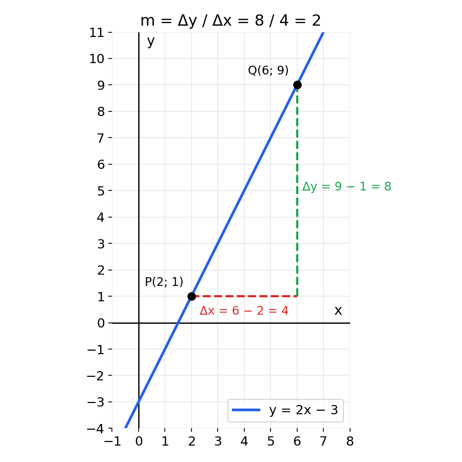
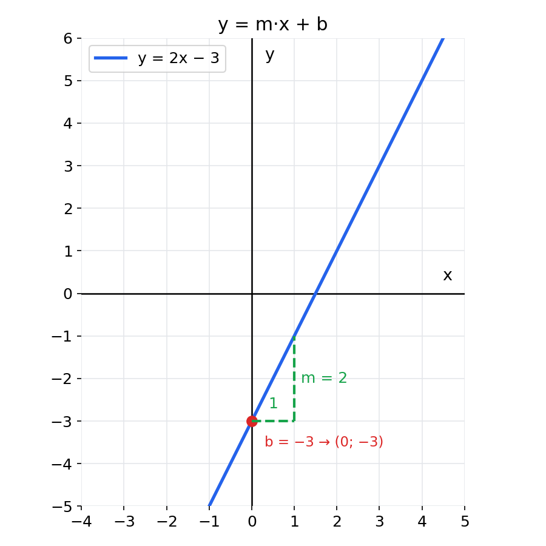
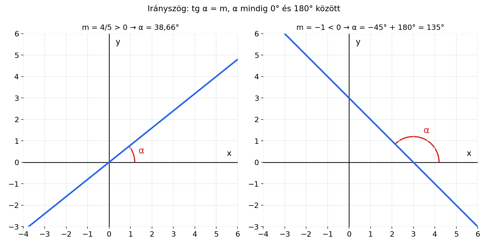
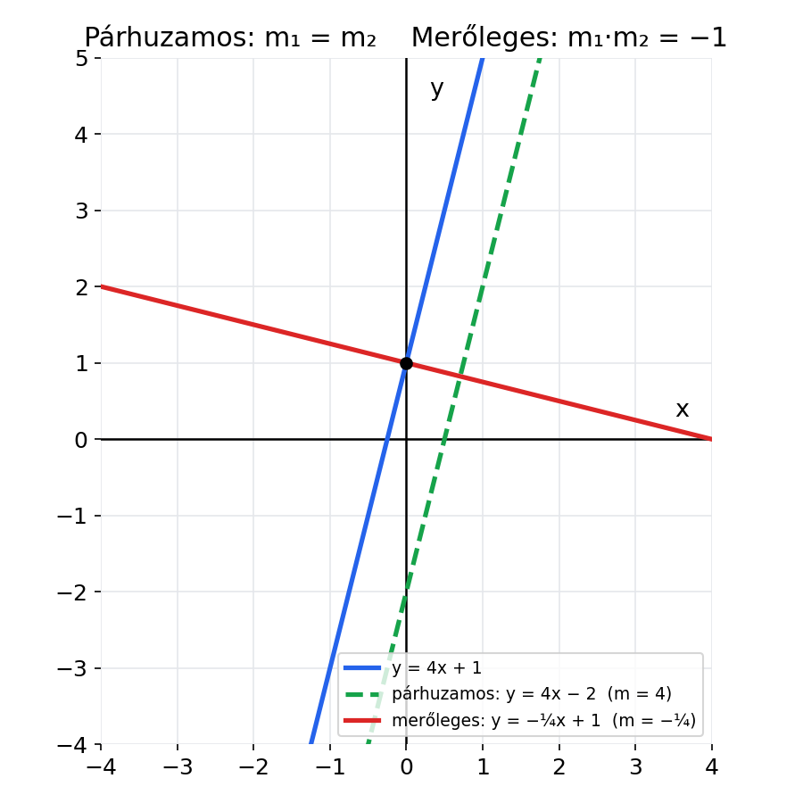
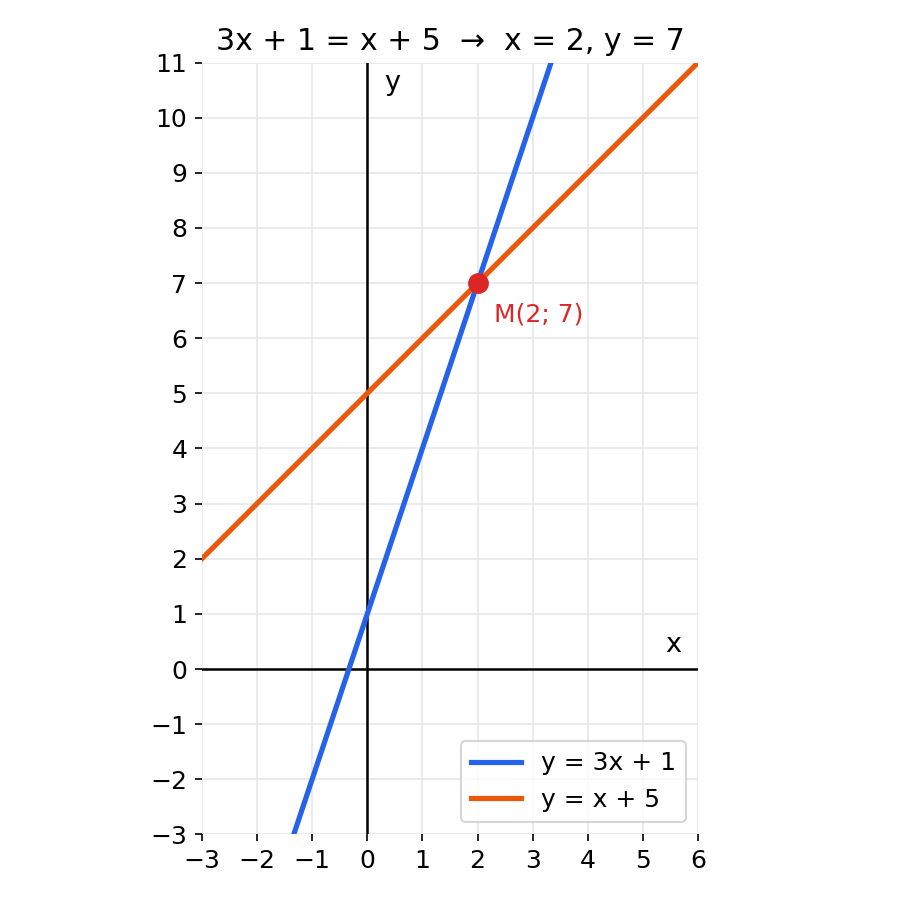
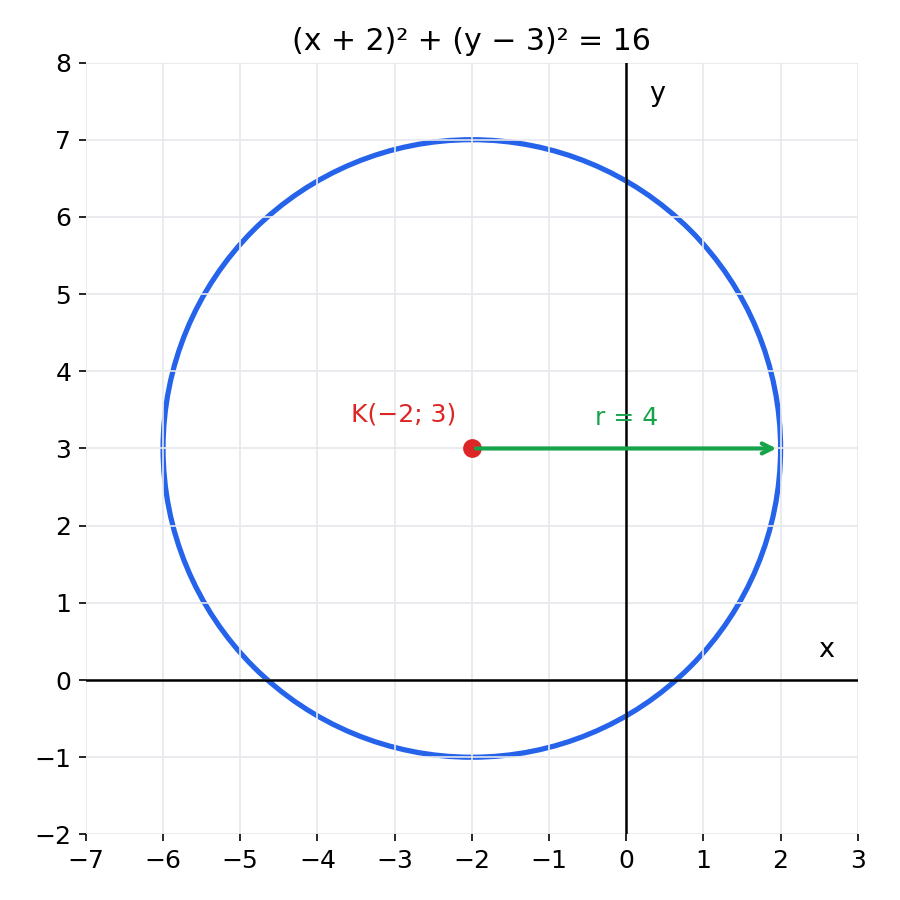
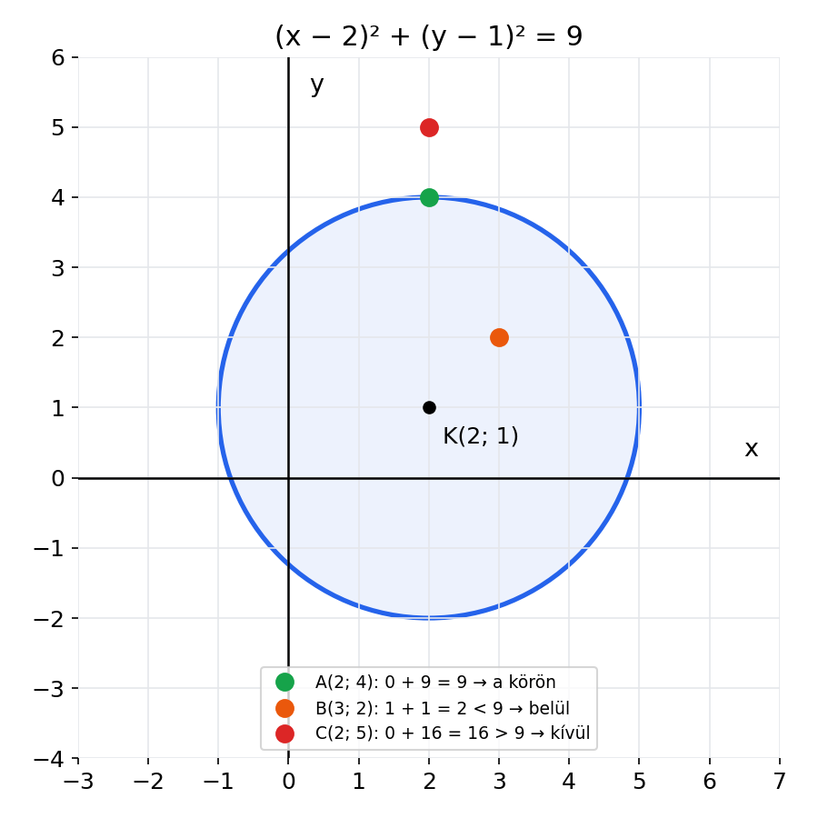
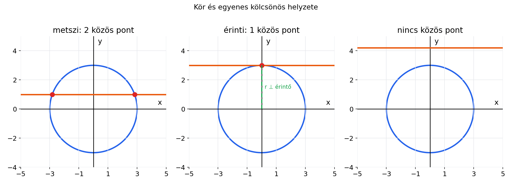

# Egyenesek és körök – összefoglaló

Koordinátageometria: meredekség, az egyenes egyenlete, párhuzamos és merőleges egyenesek, metszéspont, a kör egyenlete.

## Tartalom

1. [Meredekség](#1-meredekség)
2. [Az egyenes egyenlete](#2-az-egyenes-egyenlete)
3. [Irányszög](#3-irányszög)
4. [Párhuzamos és merőleges egyenesek](#4-párhuzamos-és-merőleges-egyenesek)
5. [Két egyenes metszéspontja](#5-két-egyenes-metszéspontja)
6. [A kör egyenlete](#6-a-kör-egyenlete)
7. [Teljes négyzetté alakítás](#7-teljes-négyzetté-alakítás)
8. [Pont és kör](#8-pont-és-kör)
9. [Kör és egyenes](#9-kör-és-egyenes)
10. [Képletgyűjtemény](#képletgyűjtemény)

---

## 1. Meredekség

A meredekség (**m**) megmutatja, mennyit megy fel vagy le az egyenes, ha 1-et lépsz jobbra.

$$m = \frac{y_2 - y_1}{x_2 - x_1} = \frac{\Delta y}{\Delta x}$$



**Példa:** P(2; 1) és Q(6; 9)

$$m = \frac{9 - 1}{6 - 2} = \frac{8}{4} = 2$$

- Ha **m > 0**, az egyenes emelkedik.
- Ha **m < 0**, az egyenes csökken.
- Ha **m = 0**, az egyenes vízszintes (y = b).
- A függőleges egyenes (**x = c**) meredeksége nem értelmezett.

---

## 2. Az egyenes egyenlete

$$y = m \cdot x + b$$

- **m** a meredekség (az x előtti szám).
- **b** az y-tengellyel való metszéspont, vagyis a **(0; b)** pont.



### Egyenes felírása egy pontból és a meredekségből

1. Beírod a meredekséget: y = mx + b.
2. Behelyettesíted a pont x és y értékét, és kiszámolod b-t.

**Példa:** m = 2, P(2; 1)

$$1 = 2 \cdot 2 + b \;\Rightarrow\; b = -3 \;\Rightarrow\; y = 2x - 3$$

### Egyenes felírása két pontból

1. Kiszámolod m-et.
2. Az egyik pontot behelyettesíted.

**Példa:** P(4; −8), Q(−3; 6)

$$m = \frac{6 - (-8)}{-3 - 4} = \frac{14}{-7} = -2 \;\Rightarrow\; y + 8 = -2(x - 4) \;\Rightarrow\; y = -2x$$

> **Pont-meredekség alak:** $y - y_0 = m(x - x_0)$

### Tengelymetszetek

| Tengely | Mit helyettesítesz? | Példa: y = (2/5)x − 3 |
|---|---|---|
| y-tengely | x = 0 | (0; −3) |
| x-tengely | y = 0 | 0 = (2/5)x − 3, ebből x = 7,5, tehát (7,5; 0) |

### Rajta van-e a pont az egyenesen?

Behelyettesíted a pontot. Ha az egyenlőség igaz, a pont rajta van.

**Példa:** y = −x + 1 és A(−4; 5): −(−4) + 1 = 5 ✅

---

## 3. Irányszög

Az irányszög (**α**) az egyenes és az x-tengely pozitív iránya által bezárt szög.

$$\operatorname{tg}\alpha = m \qquad \alpha = \arctan(m)$$



> ⚠️ Az irányszög **0° és 180° között** van. Ha az arctan negatív eredményt ad, **adj hozzá 180°-ot**.

| m | arctan(m) | α |
|---|---|---|
| 4/5 | 38,66° | **38,66°** |
| −1 | −45° | **135°** |
| −1/3 | −18,43° | **161,57°** |
| −4/7 | −29,74° | **150,26°** |

**Lejtő:** a 12%-os emelkedő azt jelenti, hogy tg α = 12/100 = 0,12, vagyis α ≈ 6,84°.

---

## 4. Párhuzamos és merőleges egyenesek



| Kapcsolat | Feltétel | Példa (m₁ = 4) |
|---|---|---|
| Párhuzamos | $m_1 = m_2$ | m₂ = 4 |
| Merőleges | $m_1 \cdot m_2 = -1$ | m₂ = −1/4 |

**Merőleges meredekség két lépésben:**

1. **Fordítsd meg** a törtet (a számláló és a nevező helyet cserél).
2. **Cserélj előjelet.**

| m | Merőleges meredekség |
|---|---|
| 2 | −1/2 |
| 3 | −1/3 |
| −4 | 1/4 |
| −2/5 | 5/2 |
| 3/7 | −7/3 |

> 💡 Ha az eredeti negatív, a merőleges **pozitív** lesz, és fordítva.
> Ellenőrzés: a két meredekség szorzata **−1**.

---

## 5. Két egyenes metszéspontja

A metszéspont **mindkét egyenesen rajta van**, ezért a két egyenletet együtt kell megoldani.



### a) Ha mindkettő y = … alakú

Egyenlővé teszed a két jobb oldalt:

$$3x + 1 = x + 5 \;\Rightarrow\; 2x = 4 \;\Rightarrow\; x = 2, \quad y = 7$$

A metszéspont: **M(2; 7)**.

### b) Egyenlő együtthatók módszere

Úgy alakítod az egyenleteket, hogy összeadva vagy kivonva **az egyik ismeretlen kiessen**.

| Előjelek | Mit csinálsz? |
|---|---|
| Ellentétes (+y és −y) | **Összeadod** az egyenleteket |
| Azonos (+y és +y) | **Kivonod** őket |

**Példa:**

```
 2x + y = 10
 3x − y = 5
 ─────────── összeadás
 5x     = 15  →  x = 3
 2·3 + y = 10 →  y = 4
```

A metszéspont: **(3; 4)**.

**Ha nem esik ki magától, szorozni kell:**

```
 3x −  y = 16   / ·5
 2x + 5y = 5

15x − 5y = 80
 2x + 5y = 5
 ─────────── összeadás
17x      = 85  →  x = 5,  y = −1
```

### c) Behelyettesítéses módszer

Az egyik egyenletből kifejezed y-t (vagy x-et), és beírod a másikba.

> ✅ **Mindig ellenőrizz** úgy, hogy a megoldást a *másik* egyenletbe is behelyettesíted!
> Ha tört jön ki (például y = 8/3), hagyd tört alakban, az pontos.

---

## 6. A kör egyenlete

K(u; v) középpontú, r sugarú kör:

$$(x - u)^2 + (y - v)^2 = r^2$$



> ⚠️ **Előjelcsere!** A zárójelben mindig **mínusz** van.
> - K(−2; 3) esetén (x **+** 2)² + (y **−** 3)²
> - (y + 6)² esetén v = **−6**

> ⚠️ A jobb oldalon **r²** áll, nem r!
> (x − 1)² + (y + 6)² = 49 esetén **r = 7**.

| Egyenlet | Középpont | Sugár |
|---|---|---|
| (x − 2)² + (y − 5)² = 9 | K(2; 5) | 3 |
| (x + 2)² + (y − 3)² = 16 | K(−2; 3) | 4 |
| (x − 1)² + (y + 6)² = 49 | K(1; −6) | 7 |
| x² + y² = 100 | K(0; 0) | 10 |

---

## 7. Teljes négyzetté alakítás

Ha a kör egyenlete **kifejtett alakban** van (x² + y² + … = 0), vissza kell alakítani.

**A trükk:** az x-es tag együtthatójának **fele** kerül a zárójelbe, és a **négyzetét levonod**.

$$x^2 - 6x = (x - 3)^2 - 9$$

**Példa:** x² + y² − 4x + 6y − 12 = 0

```
(x² − 4x) + (y² + 6y) − 12 = 0
(x − 2)² − 4 + (y + 3)² − 9 − 12 = 0
(x − 2)² + (y + 3)² = 25
```

Tehát **K(2; −3), r = 5**.

**Még egy:** x² + y² − 6x − 2y + 6 = 0

```
(x − 3)² − 9 + (y − 1)² − 1 + 6 = 0
(x − 3)² + (y − 1)² = 4
```

Tehát **K(3; 1), r = 2**.

---

## 8. Pont és kör

### Hol van a pont?

Behelyettesíted a pontot a bal oldalba, és összehasonlítod az eredményt r²-tel.



| Eredmény | Helyzet |
|---|---|
| = r² | a körön |
| < r² | a körön belül |
| > r² | a körön kívül |

### Kör felírása középpontból és egy pontból

A sugár a két pont távolsága:

$$r^2 = (x_2 - x_1)^2 + (y_2 - y_1)^2$$

**Példa:** K(0; 0), a kör átmegy a (6; 8) ponton.

$$r^2 = 6^2 + 8^2 = 100 \;\Rightarrow\; x^2 + y^2 = 100$$

> 💡 Gyököt sem kell vonni, mert az egyenletbe úgyis r² kell.

---

## 9. Kör és egyenes

Az egyenesből kifejezed y-t, beírod a kör egyenletébe, és **másodfokú egyenletet** kapsz.



| Megoldások száma | Helyzet |
|---|---|
| 2 | az egyenes **metszi** a kört |
| 1 | az egyenes **érinti** a kört |
| 0 | nincs közös pont |

**Érintő:** merőleges a sugárra az érintési pontban. Kiszámolod a KP sugár meredekségét, és az érintő meredeksége ennek **−1/m**-szerese.

---

## Képletgyűjtemény

| Mi? | Képlet |
|---|---|
| Meredekség | $m = \dfrac{y_2 - y_1}{x_2 - x_1}$ |
| Egyenes egyenlete | $y = mx + b$ |
| Pont-meredekség alak | $y - y_0 = m(x - x_0)$ |
| Irányszög | $\operatorname{tg}\alpha = m$, negatív eredménynél +180° |
| Párhuzamos | $m_1 = m_2$ |
| Merőleges | $m_1 \cdot m_2 = -1$ |
| Felezőpont | $F\left(\dfrac{x_1 + x_2}{2};\ \dfrac{y_1 + y_2}{2}\right)$ |
| Két pont távolsága | $d = \sqrt{(x_2 - x_1)^2 + (y_2 - y_1)^2}$ |
| Kör egyenlete | $(x - u)^2 + (y - v)^2 = r^2$ |

## Gyakori hibák

- ❌ Merőlegesnél csak előjelet cserélsz → ✅ **fordítani is** kell: 4-ből **−1/4** lesz, nem −4.
- ❌ Negatív irányszög → ✅ **+180°**.
- ❌ K(−2; 3) esetén (x − 2)² → ✅ **(x + 2)²**.
- ❌ r² = 16 esetén r = 16 → ✅ **r = 4**.
- ❌ +y és −y esetén kivonod az egyenleteket → ✅ **összeadod** őket.
